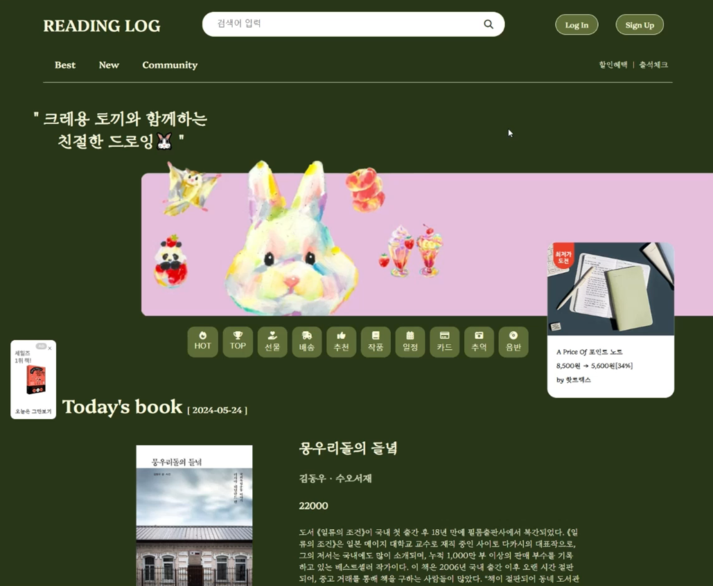

# Reading Log

### 도서 쇼핑과 독서 리뷰가 결합된 커뮤니티 플랫폼

멀티캠퍼스 풀스택 22기 세미프로젝트

## 개발 목적

기존의 도서 구매 사이트에 커뮤니티 기능을 추가하여, 사용자가 책에 대한 주제로 자유롭게 의견을 나누고 소통할 수 있도록 합니다.

## 사용 기술

<table>
  <tr>
    <td>언어</td>
    <td>Javascript, Java, HTML, CSS</td>
  </tr>
  <tr>
    <td>서버</td>
    <td>Apache Tomcat 10</td>
  </tr>
  <tr>
    <td>프레임워크</td>
    <td>Spring Boot</td>
  </tr>
  <tr>
    <td>DB</td>
    <td>MySQL</td>
  </tr>
  <tr>
    <td>IDE</td>
    <td>Visual Studio Code</td>
  </tr>
  <tr>
    <td>API</td>
    <td>Kakao 도서 api</td>
  </tr>
</table>
